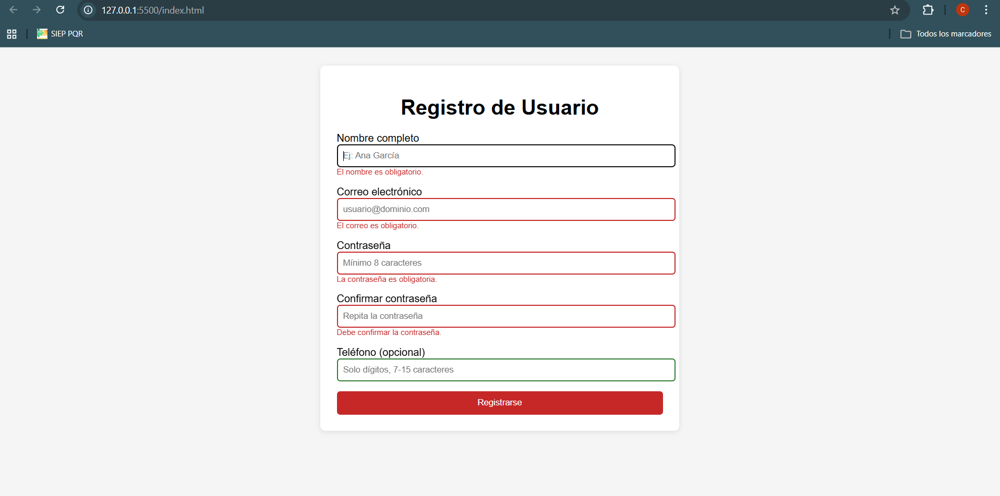
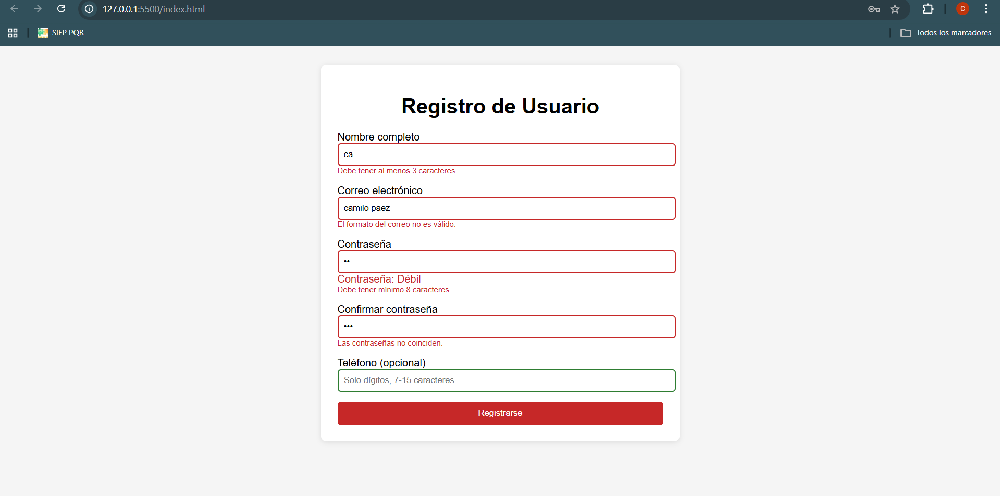
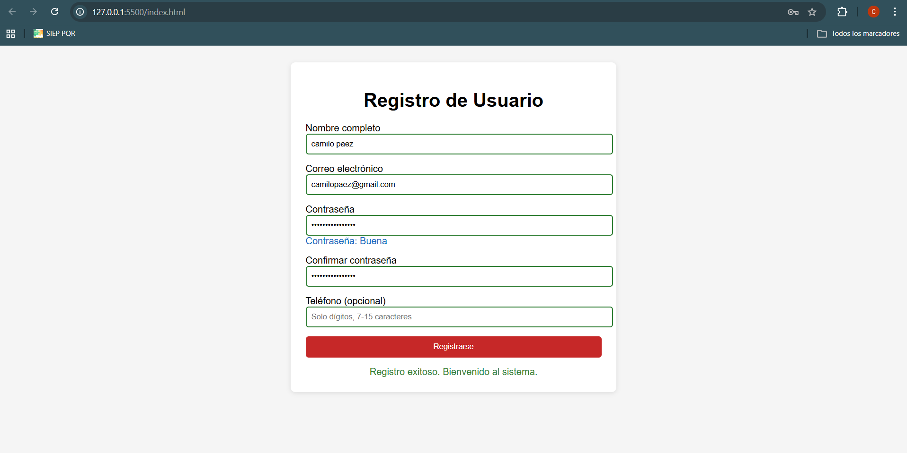
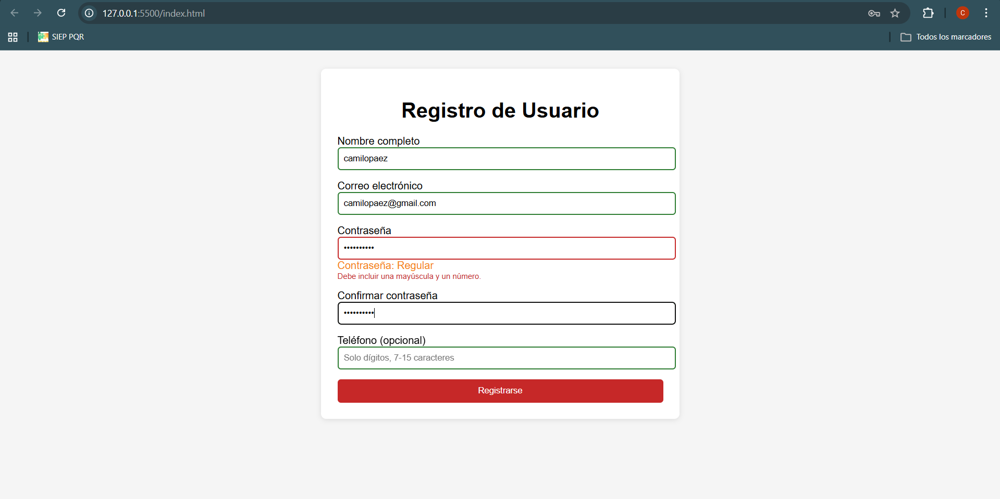

# Formulario de Registro con Validación — JavaScript

## 📌 Descripción

Este proyecto consiste en la implementación de un formulario de registro de usuario con validación completa del lado del cliente. Se combinan validaciones nativas de HTML5 con validaciones personalizadas en JavaScript, proporcionando retroalimentación visual inmediata al usuario.

## 🚀 Tecnologías utilizadas

- HTML5
- CSS3
- JavaScript (ES6)

## ⚙️ Funcionalidades

- Validación de campos obligatorios
- Validación de formato de correo electrónico
- Validación de contraseña (mínimo 8 caracteres, mayúscula y número)
- Confirmación de contraseña
- Validación de teléfono con patrón (opcional)
- Validación en tiempo real usando eventos `blur` e `input`
- Mensajes de error personalizados por campo
- Control del evento submit (no recarga la página)
- Mensaje de registro exitoso
- Indicador de fortaleza de contraseña en tiempo real

## ▶️ Cómo ejecutar el proyecto

1. Abrir la carpeta en Visual Studio Code
2. Abrir el archivo `index.html`
3. Ejecutar con la extensión **Live Server**

## 📸 Capturas del proyecto

### Validación de errores

### Validación en tiempo real

### Registro exitoso

### Fortaleza de contraseña

